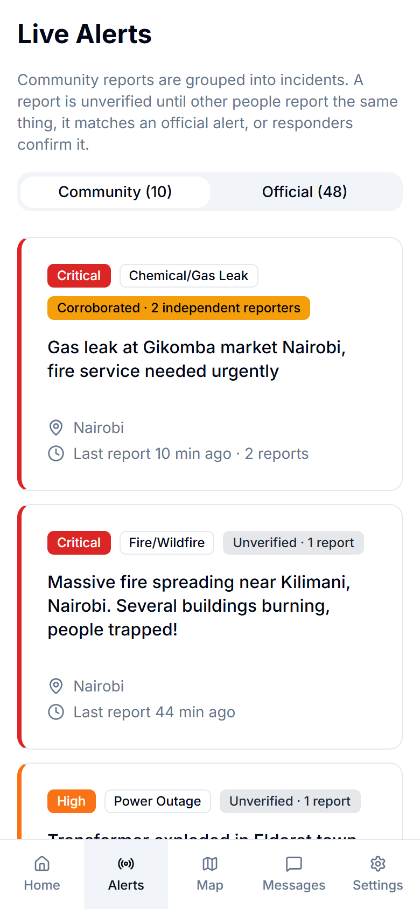
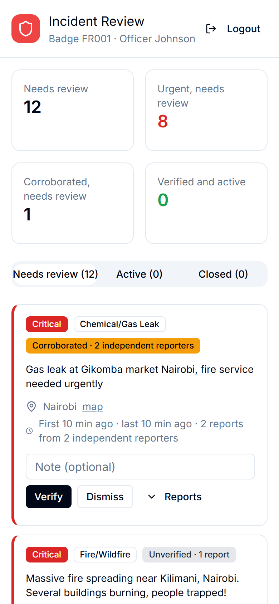
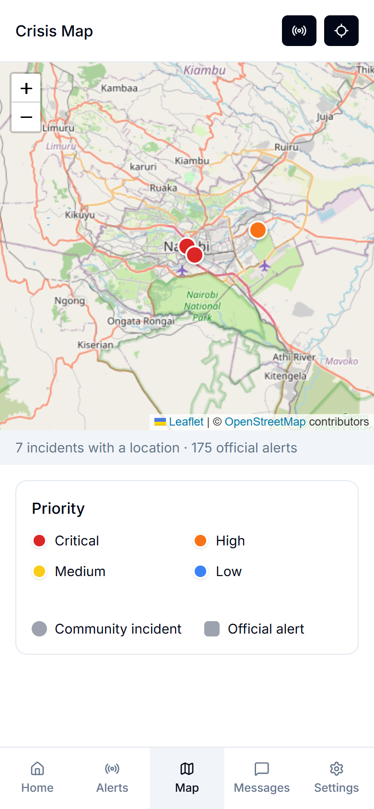

<div align="center">
  

  **Community crisis reporting with ML triage and corroboration-based verification.**
</div>

CrisisConnect lets people report emergencies from their phone (even offline), groups reports about the same event into incidents, and gives responders a triage queue. Machine learning sorts and prioritizes reports; it does not decide what is true. Trust comes from **corroboration**: independent reporters agreeing, a photo that shows a crisis, or a matching alert from an official source, and finally a responder's review.

<p align="center">
  
  
  
</p>

## How it works

1. **Report.** A resident picks a category, describes what is happening and optionally attaches a photo. Without a connection, the report is queued in IndexedDB and sent when the device is back online; the app itself is a PWA that loads offline.
2. **Analyze.** The API server runs the text through a pipeline: a fine-tuned crisis classifier, a priority classifier, named-entity recognition for the location, and geocoding. Photos are checked with Gemini. Every stage has a fallback (zero-shot model, keyword heuristics, regex), so no report is lost when a model is unavailable.
3. **Group.** Reports of the same type within 3 km and 6 hours form one incident. Its corroboration level counts independent reporters (all anonymous reports together count as one, so one person cannot fake a crowd), photo evidence, and official alerts from **USGS** (earthquakes) and **GDACS** (cyclones, floods, wildfires) matched by place and time.
4. **Review.** Responders work through a queue sorted by priority and corroboration, see each reporter's track record, and verify, dismiss or resolve incidents. The public feed labels every incident honestly ("Unverified · 1 report", "Corroborated · 3 independent reporters", "Verified by responders") and hides dismissed ones.

## Machine learning

Two RoBERTa classifiers fine-tuned from [`CT-M1-Complete`](https://huggingface.co/crisistransformers/CT-M1-Complete) (training: [crisisconnectmodels](https://github.com/isaac-ron/crisisconnectmodels)), evaluated only on data never used for training or model selection:

| Model | Test set | Result |
|---|---|---|
| [Crisis detector](https://huggingface.co/ron4444444/crisis-binary-model) | [NLP with Disaster Tweets](https://www.kaggle.com/competitions/nlp-getting-started), 6,737 tweets | 79.8% accuracy, macro F1 0.777 |
| [Priority classifier](https://huggingface.co/ron4444444/crisis-priority-model) | [TREC Incident Streams](https://www.dcs.gla.ac.uk/~richardm/TREC_IS/), 10,210 tweets from unseen disasters | macro F1 0.416 (previous model: 0.273); urgent recall 60% (previous: 36%) |

Both are served as **int8-quantized ONNX models**: 515 MB → 130 MB each, with 98% / 96% agreement with full precision, so the ML service runs in ~370 MB on a free 512 MB instance. Details, including what didn't work, are in [ml-service/README.md](ml-service/README.md).

## Architecture

```
frontend/      React + TypeScript PWA (Vite, Tailwind, Leaflet)
     │  REST
server/        Node.js + Express API, PostgreSQL via Prisma
     │           ├─ NLP pipeline: crisis detection, category, priority, location, geocoding (Nominatim)
     │           ├─ incident grouping, corroboration, responder review
     │           ├─ official feeds: USGS, GDACS
     │           └─ photo analysis: Gemini
     │  HTTP
ml-service/    Python FastAPI, ONNX Runtime: crisis detector + priority classifier (from Hugging Face Hub)
```

## Running locally

Requires Node.js 20+, Python 3.12, and PostgreSQL.

```bash
# API
cd server
cp .env.example .env            # set DATABASE_URL and JWT_SECRET; the rest is optional
npm ci
npx prisma migrate deploy
SEED_ADMIN_PASSWORD=choose-one npm run seed:users   # demo users, a responder (FR001 / emergency123) and an admin
npm run dev                     # http://localhost:3000

# ML service (optional: without it the API falls back to heuristics)
cd ml-service
pip install -r requirements.txt
python app.py                   # http://localhost:8000/docs

# Frontend
cd frontend
npm ci
npm run dev                     # http://localhost:5173
```

## Tests

```bash
cd server && SEED_ADMIN_PASSWORD=... npm test   # end-to-end: auth, permissions, reports, incidents, review, feeds
cd ml-service && pytest                          # label mapping
cd frontend && npm run lint && npm run build
```

## Deployment

`render.yaml` deploys the database, API, ML service and static frontend on Render's free tier. The ML service downloads the ONNX models from Hugging Face on startup.

## Limitations

- Classifying text does not verify it. The design relies on corroboration and human review for that, and labels anything unreviewed as unverified.
- The project's own training tweets are Kenya-focused and template-like; scores on real-world benchmarks (above) are lower than on that data, and those are the numbers reported.
- The priority model over-escalates minor local incidents ("small leak", "no injuries"); responders see it as a hint, not a decision.
- Twitter/X is not used as a source: its API is now pay-per-read. Official feeds and direct community reports replace it.

## Author

Ron Isaac· [github.com/isaac-ron/TSCrisisConnect](https://github.com/isaac-ron/TSCrisisConnect)
